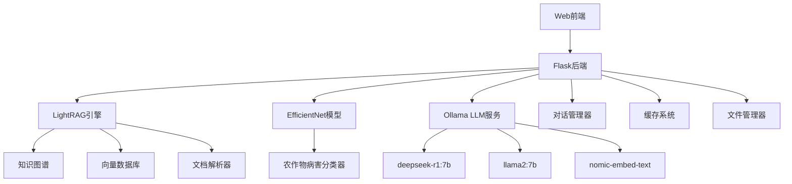

# NianFengLLM - 农业智能大模型系统

<div align="center">


**基于LightRAG的多语种多模态农业智能问答系统**

[功能特性](#功能特性) • [快速开始](#快速开始) • [系统架构](#系统架构) • [API文档](#api文档) • [部署指南](#部署指南)

</div>

## 📖 项目简介

NianFengLLM是一个基于LightRAG框架开发的多语种多模态农业智能大模型系统。该系统结合了图谱检索增强生成(Graph-based RAG)技术和深度学习的农作物病害识别能力，为农业从业者提供智能化的农业知识问答和病害诊断服务。


### 🌟 核心特色

- **🧠 智能问答**：基于LightRAG的图谱检索增强生成，提供准确的农业知识问答
- **👁️ 病害识别**：集成EfficientNet模型，支持39种农作物病害的智能识别
- **🌐 多语言支持**：支持中英文双语交互，适应国际化需求
- **📚 文档理解**：支持PDF等多格式农业文档的上传和智能解析
- **💬 对话记忆**：完整的对话历史管理，支持上下文连续对话
- **⚡ 高性能**：基于异步架构，支持高并发访问

## 🎯 功能特性

### 📊 农作物病害识别
- 支持39种常见农作物病害识别
- 涵盖苹果、玉米、葡萄、番茄、土豆等主要作物
- 基于EfficientNet深度学习模型，识别准确率高
- 支持图片上传和实时预测

### 🔍 智能农业问答
- 基于LightRAG的图谱检索技术
- 支持多种查询模式：全局、局部、混合、朴素、混合模式
- 智能文档解析和知识抽取
- 上下文感知的对话系统

### 📋 支持的农作物及病害

<details>
<summary>点击查看完整病害分类列表</summary>

| 序号 | 作物 | 病害类型 |
|-----|------|---------|
| 0-3 | 苹果 | 苹果黑星病、黑腐病、锈病、健康 |
| 5-7 | 蓝莓/樱桃 | 健康、白粉病、健康 |
| 8-11 | 玉米 | 灰斑病、锈病、叶枯病、健康 |
| 12-15 | 葡萄 | 黑腐病、白腐病、叶斑病、健康 |
| 16-18 | 橙子/桃子 | 黄龙病、细菌性斑点病、健康 |
| 19-28 | 辣椒/土豆/草莓等 | 细菌性斑点病、早疫病、晚疫病等 |
| 29-38 | 番茄 | 细菌性斑点病、早疫病、晚疫病、叶霉病等 |

</details>

## 🚀 快速开始

### 环境要求

- Python 3.9+
- CUDA支持的GPU (推荐)
- Ollama (用于本地LLM推理)
- 8GB+ RAM

### 安装步骤

1. **克隆项目**
```bash
git clone https://github.com/your-repo/NianFengLLM.git
cd NianFengLLM
```

2. **安装依赖**
```bash
pip install -r requirements.txt
```

3. **安装LightRAG**
```bash
cd LightRAG
pip install -e .
```

4. **配置Ollama**
```bash
# 安装Ollama
curl -fsSL https://ollama.ai/install.sh | sh

# 拉取所需模型
ollama pull deepseek-r1:7b      # 对话模型,或者用自己微调的模型替换
ollama pull llama2:7b           # RAG检索模型，或者用自己微调的模型替换
ollama pull nomic-embed-text    # 嵌入模型，BGE
```

5. **准备模型权重**
```bash
# 下载预训练的农作物病害识别模型权重到 App/weights/ 目录
mkdir -p App/weights
# 将您的模型权重文件放置到此目录
```

6. **启动服务**
```bash
cd App
python app.py
```

7. **访问系统**
   - 主界面：http://localhost:5000
   - 聊天界面：http://localhost:5000/chat
   - PDF管理：http://localhost:5000/manage_pdf

## 🏗️ 系统架构



### 核心组件

- **Web界面**：基于Flask的响应式Web界面
- **LightRAG引擎**：图谱检索增强生成核心
- **病害识别模型**：基于EfficientNet的深度学习模型
- **对话管理**：支持多会话并发和历史记录
- **缓存系统**：多级缓存提升响应性能

## 📡 API文档

### 病害识别API

```http
POST /predict_disease
Content-Type: multipart/form-data

Parameters:
- file: 图片文件 (jpg, png, jpeg)
```

**响应示例：**
```json
{
    "success": true,
    "prediction": "Tomato___Early_blight",
    "confidence": 0.95,
    "disease_name": "番茄早疫病",
    "processing_time": 1.23
}
```

### 智能问答API

```http
POST /llama2_chat
Content-Type: application/json

{
    "message": "请介绍一下番茄早疫病的防治方法",
    "conversation_id": "abc123"
}
```

**响应示例：**
```json
{
    "success": true,
    "response": "番茄早疫病的防治方法包括...",
    "conversation_id": "abc123",
    "processing_time": 2.15
}
```

### 文档上传API

```http
POST /upload_document
Content-Type: multipart/form-data

Parameters:
- file: PDF文档文件
```

### RAG查询API

```http
POST /query_document
Content-Type: application/json

{
    "query": "如何防治玉米病害？",
    "mode": "hybrid"
}
```

## 📁 项目结构

```
NianFengLLM/
├── App/                          # 主应用目录
│   ├── app.py                   # Flask主应用
│   ├── _003_SfEfficientNet.py   # EfficientNet模型定义
│   ├── classes.json             # 病害分类定义
│   ├── static/                  # 静态文件
│   │   ├── index.html          # 主页面
│   │   ├── chat.html           # 聊天界面
│   │   ├── pdf_manager.html    # PDF管理界面
│   │   ├── chat.js             # 前端JavaScript
│   │   └── chat.css            # 样式文件
│   ├── weights/                 # 模型权重文件
│   ├── uploads/                 # 上传文件目录
│   └── images/                  # 图片资源
├── LightRAG/                     # LightRAG核心框架
├── examples/                     # 示例代码
├── requirements.txt             # Python依赖
└── README.md                    # 项目说明
```

## 🔧 配置说明

### 主要配置参数

在`App/app.py`中可以修改以下配置：

```python
# Ollama服务配置
app.config['OLLAMA_HOST'] = "http://localhost:11435"
app.config['LLM_MODEL'] = "deepseek-r1:7b"      # 对话模型
app.config['RAG_MODEL'] = "llama2:7b"           # RAG模型
app.config['EMBEDDING_MODEL'] = "nomic-embed-text"  # 嵌入模型

# 文件上传配置
app.config['UPLOAD_FOLDER'] = './uploads'
app.config['MAX_CONTENT_LENGTH'] = 16 * 1024 * 1024  # 16MB

# 并发配置
MAX_WORKERS = min(32, (os.cpu_count() or 1) + 4)
```

### 环境变量

可以通过环境变量覆盖默认配置：

```bash
export OLLAMA_HOST="http://your-ollama-host:11434"
export LLM_MODEL="your-preferred-model"
export TOP_K=60  # RAG检索数量
```

## 🚀 部署指南

### Docker部署

1. **构建镜像**
```bash
docker build -t nianfeng-llm .
```

2. **运行容器**
```bash
docker run -d \
  --name nianfeng-llm \
  -p 5000:5000 \
  -v $(pwd)/uploads:/app/uploads \
  -v $(pwd)/weights:/app/weights \
  nianfeng-llm
```

### 生产环境部署

1. **使用Gunicorn**
```bash
pip install gunicorn
gunicorn -c gunicorn_config.py app:app
```

2. **使用Nginx反向代理**
```nginx
server {
    listen 80;
    server_name your-domain.com;
    
    location / {
        proxy_pass http://127.0.0.1:5000;
        proxy_set_header Host $host;
        proxy_set_header X-Real-IP $remote_addr;
    }
}
```

### 系统服务配置

创建systemd服务文件：

```bash
sudo cp lightrag.service.example /etc/systemd/system/nianfeng-llm.service
sudo systemctl enable nianfeng-llm
sudo systemctl start nianfeng-llm
```

## 📊 性能优化

### 缓存策略
- **响应缓存**：缓存常见问答结果
- **RAG缓存**：缓存文档检索结果
- **模型缓存**：缓存图像识别结果

### 并发优化
- 异步HTTP会话池
- 线程池执行器
- 连接池管理

### 内存管理
- 对话历史自动清理
- 缓存大小限制
- 资源自动回收

## 🔍 监控与日志

### 系统监控
访问 `/system_info` 端点查看系统状态：
- CPU和内存使用率
- GPU状态
- 模型加载状态
- 缓存统计信息

### 日志配置
```python
import logging
logging.basicConfig(
    level=logging.INFO,
    format='%(asctime)s - %(levelname)s - %(message)s'
)
```

## 🤝 贡献指南

我们欢迎各种形式的贡献！

1. Fork 项目
2. 创建特性分支 (`git checkout -b feature/AmazingFeature`)
3. 提交更改 (`git commit -m 'Add some AmazingFeature'`)
4. 推送到分支 (`git push origin feature/AmazingFeature`)
5. 开启 Pull Request

## 📄 许可证

本项目基于 MIT 许可证开源 - 查看 [LICENSE](LICENSE) 文件了解详情。

## 🙏 致谢

- [LightRAG](https://github.com/HKUDS/LightRAG) - 图谱检索增强生成框架
- [Ollama](https://ollama.ai/) - 本地LLM推理引擎
- [Flask](https://flask.palletsprojects.com/) - Web框架
- [PyTorch](https://pytorch.org/) - 深度学习框架

## 📞 联系我们

- 项目主页：[https://github.com/your-repo/NianFengLLM](https://github.com/your-repo/NianFengLLM)
- 问题反馈：[Issues](https://github.com/your-repo/NianFengLLM/issues)
- 邮箱：warriorxu@magicap.net

---

<div align="center">

**🌾 让AI赋能农业，让科技服务三农 🌾**

Made with ❤️ by NianFengLLM Team

</div>
